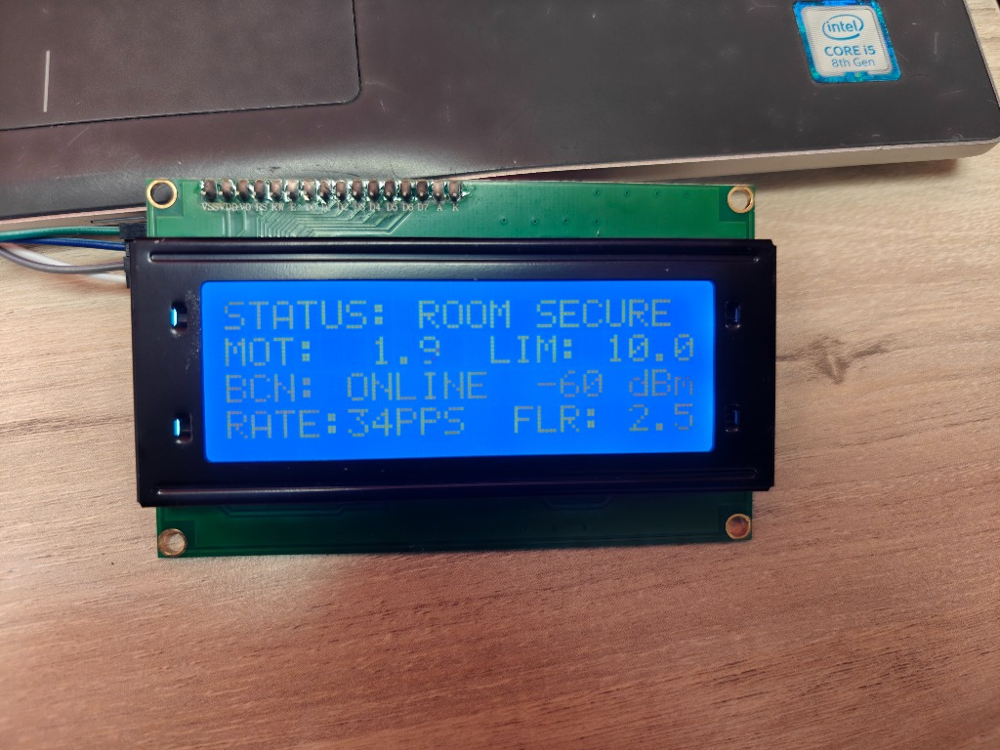
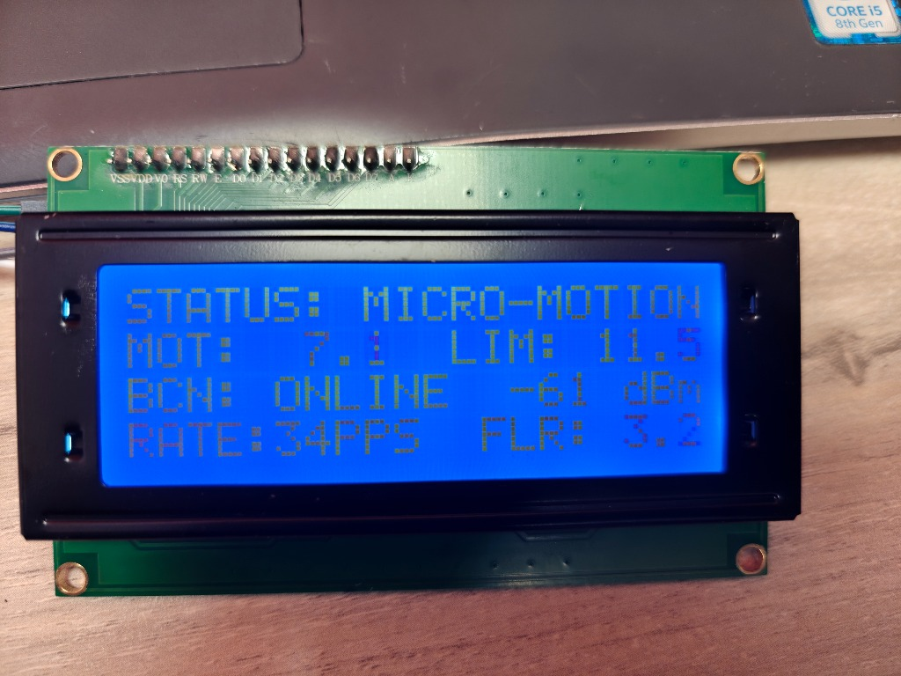

# 📡 Wi-Fi RF Motion Detection Radar (ESP32 + ESP8266) — v2.0

An **RF Multipath & CSI (Channel State Information) Wi-Fi Radar** built with **one ESP8266** and **one ESP32**, engineered according to state-of-the-art research from **Espressif esp-csi**, **ESPectre**, and **WaveSight**.

> **No external sensors required!** This system uses the electromagnetic Wi-Fi field itself as the radar. When a person walks or moves between the two devices, their body perturbs the 2.4 GHz radio waves and OFDM subcarriers.

---

## 🔬 State-of-the-Art DSP Pipeline (v2.0)

For full mathematical derivations and academic citations, see [**`docs/RESEARCH_AND_FINETUNING.md`**](file:///d:/Radar%20ESP32/docs/RESEARCH_AND_FINETUNING.md).

1. **AGC (Automatic Gain Control) Invariant Normalization**:
   $$\hat{A}_k = \frac{A_k}{\frac{1}{K}\sum_{j=0}^{K-1} A_j}$$
   Cancels out hardware receiver gain adjustments that cause false motion spikes in ordinary CSI systems.
2. **Hampel Outlier Filter**:
   Rejects transient single-frame spikes using a sliding window median and Median Absolute Deviation (MAD).
3. **Asymmetric Dual-Rate Adaptive Baseline**:
   Freezes noise floor updates during active movement so an intruder's presence does not contaminate the ambient baseline.
4. **Transmitter MAC Pinning**:
   Locks strictly onto the ESP8266 transmitter (`84:CC:A8:81:E1:BB`), filtering out neighbor Wi-Fi chatter.
5. **Bidirectional WebSerial Protocol**:
   Real-time sensitivity sliders and instant 5-second auto-calibration directly from the browser!

```
+------------------+         RF Multipath Field (Fresnel Zone)         +------------------+
|     ESP8266      |  ~ ~ ~ ~ ~ ~ ~ ~ ~ ~ ~ ~ ~ ~ ~ ~ ~ ~ ~ ~ ~ ~ ~ >  |      ESP32       |
| (Radar TX Pulse) |            \           🚶 (Human Motion)          | (CSI RX & Radar) |
|                  |  ~ ~ ~ ~ ~  \ ~ ~ ~ ~ ~ ~ ~ ~ ~ ~ ~ ~ ~ ~ ~ ~ ~ > |                  |
+------------------+              Perturbed Subcarrier Reflection      +--------+---------+
                                                                                |
                                                                        [Serial Plotter]
                                                                        [Alert LED GPIO2]
```

1. **RF Beacon (ESP8266)**: Continuously broadcasts high-rate pulses (~30 pulses/sec) on a dedicated Wi-Fi channel (Channel 1) using **ESP-NOW** at 802.11n OFDM rates.
2. **CSI & RSSI Sampling (ESP32)**: The ESP32 hardware radio demodulates the signal into OFDM subcarriers via its built-in CSI engine.
3. **Perturbation Metric**:
   $$\Delta_{CSI} = \frac{1}{N} \sum_{i=0}^{N-1} |A_{t}(i) - A_{t-1}(i)|$$
   Where $A(i) = |I_i| + |Q_i|$ is the amplitude of the $i$-th subcarrier.
4. **Adaptive Noise Floor & Statistical Filtering**: A rolling window calculates standard deviation and baseline ambient room noise. When motion disturbance exceeds the adaptive threshold, a motion alert triggers.

---

## 📁 Repository Structure

- [`esp8266_tx_beacon/esp8266_tx_beacon.ino`](file:///d:/Radar%20ESP32/esp8266_tx_beacon/esp8266_tx_beacon.ino): Firmware for the ESP8266 transmitter node.
- [`esp32_radar_rx/esp32_radar_rx.ino`](file:///d:/Radar%20ESP32/esp32_radar_rx/esp32_radar_rx.ino): Firmware for the ESP32 receiver, CSI engine, and radar detector.

---

## 🛠️ Hardware Requirements

- **1 × ESP8266** (NodeMCU, Wemos D1 Mini, ESP-01, or any generic board)
- **1 × ESP32** (ESP32 DevKit v1, NodeMCU-32S, ESP32-WROOM-32, etc.)
- **1 × 20x4 LCD with I2C Backpack (PCF8574)** *(Optional but highly recommended for standalone telemetry)*
- **4 × Female-to-Female Jumper Wires** (for I2C LCD connection)
- **2 × Micro-USB / USB-C cables** (or 5V USB power adapters)
- *Optional:* Piezo buzzer or external LED connected to ESP32 **GPIO 2**

---

## 📟 Standalone 20x4 I2C LCD Telemetry Monitor

The ESP32 receiver includes native driver support for **20x4 character LCDs** via I2C (using the industry-standard `hd44780` library by Bill Perry). It automatically probes the bus, detects the backpack address (`0x27` or `0x3F`), and displays real-time radar telemetry completely independently from the PC or web dashboard.

<p align="center">
  
  
</p>

### 🔌 Wiring Diagram

| 20x4 I2C LCD Pin | ESP32 Pin | Function | Notes |
| :--- | :--- | :--- | :--- |
| **VCC** | **VIN (5V)** | Power Supply | **Must connect to 5V/VIN** for optical contrast (3.3V is too low) |
| **GND** | **GND** | Ground | Common system ground |
| **SDA** | **GPIO 21 (G21)** | I2C Data | Default ESP32 hardware I2C data |
| **SCL** | **GPIO 22 (G22)** | I2C Clock | Default ESP32 hardware I2C clock (100 kHz) |

### 📋 LCD Screen Layout (4 Lines)

```text
+--------------------+
|STATUS: ROOM SECURE |  <-- Line 0: Real-time System State
|MOT:  1.9  LIM: 10.0|  <-- Line 1: Live Motion Energy vs Dynamic Threshold Limit
|BCN: ONLINE  -60 dBm|  <-- Line 2: ESP8266 Transmitter Status & RSSI
|RATE: 34PPS  FLR:2.5|  <-- Line 3: Packet Rate (PPS) & Ambient Noise Floor
+--------------------+
```

- **Line 0 (System State):**
  - `STATUS: ROOM SECURE` — Ambient room is calm; no motion detected.
  - `STATUS: MICRO-MOTION` — Slight perturbation detected (breathing, subtle movement).
  - `! INTRUSION ALERT !` — Energy crossed the dynamic threshold; active movement alert!
  - `STATUS: BCN OFFLINE ` — Transmitter beacon signal lost or out of range.
- **Line 1 (`MOT` & `LIM`):** Instantaneous filtered motion energy score vs. current dynamic trigger limit.
- **Line 2 (`BCN` & RSSI):** Health of the ESP8266 radio link and physical received signal strength in dBm.
- **Line 3 (`RATE` & `FLR`):** Real-time CSI packet arrival rate (packets per second) and the adaptive ambient noise floor.

> **💡 Hardware Tip:**
> - If characters appear faint or invisible, adjust the small **blue contrast potentiometer** on the back of the I2C module using a small screwdriver until characters appear crisp.
> - Ensure the 2-pin black jumper cap labeled **`LED`** on the back of the module is firmly seated to supply backlight power.

---

## 🚀 Quick Setup & Flashing Guide

### Step 1: Install Board Cores & Libraries in Arduino IDE
1. Open **Arduino IDE**.
2. Go to **File -> Preferences** and add the board manager URLs:
   ```text
   https://raw.githubusercontent.com/espressif/arduino-esp32/gh-pages/package_esp32_index.json
   http://arduino.esp8266.com/stable/package_esp8266com_index.json
   ```
3. Go to **Tools -> Board -> Boards Manager...**:
   - Search for **esp32** by *Espressif Systems* and click **Install**.
   - Search for **esp8266** by *ESP8266 Community* and click **Install**.
4. Go to **Sketch -> Include Library -> Manage Libraries...**:
   - Search for **`hd44780`** by *Bill Perry* and click **Install** (required for the I2C LCD).

---

### Step 2: Flash the ESP8266 Transmitter
1. Connect the **ESP8266** to your computer via USB.
2. Open [`esp8266_tx_beacon.ino`](file:///d:/Radar%20ESP32/esp8266_tx_beacon/esp8266_tx_beacon.ino).
3. Under **Tools**:
   - **Board**: Select your ESP8266 board (e.g. *NodeMCU 1.0 (ESP-12E Module)* or *LOLIN(WEMOS) D1 R2 & mini*).
   - **Port**: Select the COM port for the ESP8266.
4. Click **Upload**.
5. Once uploaded, the onboard LED will blink periodically to indicate pulses are being transmitted. You can now power it from any USB wall charger or power bank.

---

### Step 3: Flash the ESP32 Radar Receiver
1. Connect the **ESP32** to your computer via USB.
2. Open [`esp32_radar_rx.ino`](file:///d:/Radar%20ESP32/esp32_radar_rx/esp32_radar_rx.ino).
3. Under **Tools**:
   - **Board**: Select your ESP32 board (e.g. *ESP32 Dev Module*).
   - **Port**: Select the COM port for the ESP32.
4. Click **Upload**.
5. Open **Tools -> Serial Monitor** (Baud rate: **115200**) to verify initialization:
   ```text
   [OK] Hardware CSI Engine initialized.
   [STATUS] Radar listening. Auto-calibrating ambient baseline...
   ```

---

## 📊 Live Radar Waveform Display & Tactical GUI

You have **two powerful ways** to visualize the radar feed on your PC:

### Option A: Next-Gen RF·CSI Sensing Console (WebSerial Web GUI - Recommended)
1. Open Google Chrome, Microsoft Edge, Brave, or Opera.
2. Simply double-click or open [`gui/index.html`](file:///d:/Radar%20ESP32/gui/index.html) in your browser.
3. Click **⚡ Connect ESP32**, select your ESP32's COM port, and click **Connect**.
4. **Features**:
   - **Multi-Theme Engine (8 Curated Themes)**:
     - ☀️ **Yellow VMS** (Scandinavian enterprise security architecture)
     - ❄️ **Nordic Slate** (Cool steel telemetry console)
     - 🏢 **Swiss Clean** (Minimalist laboratory monochrome with signal red calipers)
     - 🌙 **Tactical Dark** (Stealth obsidian void with neon cyan phosphor)
     - ⚡ **Cyber Emerald** (CRT military radar phosphor matrix)
     - 🌌 **Deep Space** (NASA/SpaceX aerospace telemetry)
     - 🌅 **Solar Amber** (Industrial hazard and safety console)
     - 🌆 **Cyberpunk Neon** (Retrowave sunset synthwave)
   - **Fullscreen Cockpit (`⛶`)**: One-click toggle for full-screen zero-scroll landscape cockpit ergonomics.
   - **Real-Time Visualizers**:
     - 20 MHz 802.11n Wi-Fi OFDM Subcarrier Waterfall Heatmap (-26 to +26 subcarriers).
     - Live Oscilloscope Waveform tracking disturbance energy against adaptive threshold and baseline noise floor.
     - 52-Channel Subcarrier Jitter Spectrum Analyzer.
   - **High-Contrast Precision DSP Calibrator**:
     - Tactile range sliders for Sensitivity Multiplier, Noise Margin Offset, Pre-Amp Gain, Manual Threshold Override, Debounce, and Hold Duration.
     - Instant Quick-Preset Profiles (🫁 Micro-Presence, 👤 Balanced, 🏃 Walking Alarm, 🐾 Pet Immune).
     - Dynamic auto-calibration banner with countdown progress bar.
   - **Sonar Alarm & Audit Log**: Synthesized audio alert with mute toggle, plus real-time timestamped event stream.

### Option B: Standalone Python Desktop GUI
If you prefer a native desktop window:
1. Open terminal in the project directory:
   ```bash
   pip install pyserial
   python gui/radar_desktop.py
   ```
2. Select your COM port from the dropdown and click **CONNECT**.

---

## 🎯 Physical Placement & Tuning Tips

| Parameter | Recommended Setting | Purpose |
| :--- | :--- | :--- |
| **Distance** | 2 to 6 meters apart | Establishes the Fresnel reflection zone across the room. |
| **Height** | 1.0 to 1.5 meters from floor | Aligns with human torso height for maximum RF reflection. |
| **Through-Wall Sensing** | Place one node inside a room and the other in the hallway | 2.4 GHz Wi-Fi penetrates drywall and doors to detect hidden presence. |
| **`SENSITIVITY_FACTOR`** | `2.2f` (default) | Adjust in [`esp32_radar_rx.ino`](file:///d:/Radar%20ESP32/esp32_radar_rx/esp32_radar_rx.ino#L20). Lower (e.g. `1.8f`) = detects tiny motion; Higher (e.g. `2.8f`) = ignores small pets. |
| **`MOTION_TRIGGER_COUNT`** | `3` (default) | Number of consecutive frames needed to eliminate random RF noise spikes. |
